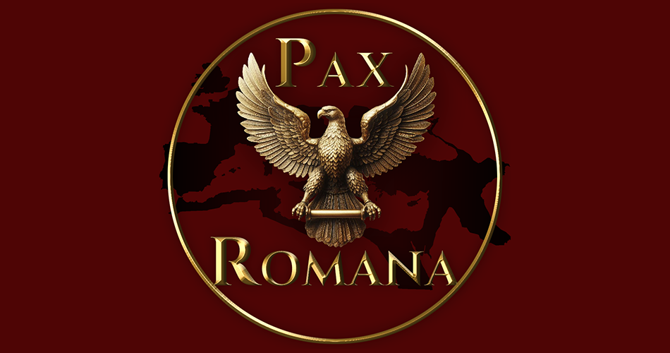

The Pax Romana Project aims at bringing the ancient times of Europe into Crusader Kings 3.

## Start Date
The first start date we are working on is 263 BCE, just a year before the start of the first Punic War. In this period, the player will have the possibility to start the war or avoid it playing as Carthage, Rome or the city-state of Messana. Meanwhile, in the east, Alexander the Great's once mighty empire is now in turmoil, and all the successor kingdoms are in an almost constant war to consolidate domain. Will anyone be able to reconquer the land of Alexander? Or will the dream of the Makédonian empire be shattered once and for all?

## New Govern Types
The first thing we wanted to flash out are the new govern types. We decided to make four:
- Tribes
>
- City-States
>
- Res Publica
>
- Kingdom
>

## Other changes
The amount of changes is immeasurable! New MAAs, new Cultures and new Religions! A different map with different rulers, a new naval warfare mechanic is in plans and new flavours! We are also thinking about more start dates!
Keep in contact and prepare to start your own Pax Romana!